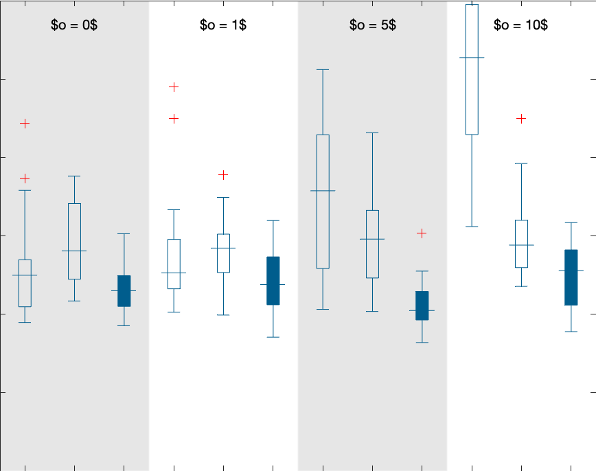

# Rao-Blackwellized Particle Smoothing for Simultaneous Localization and Mapping

This repository is the official implementation of the methods in the publication:

* Manon Kok, Arno Solin, and Thomas B. Schön (2024). **Rao-Blackwellized particle smoothing for simultaneous localization and mapping**. *Data-Centric Engineering*, 5, e15. doi: [10.1017/dce.2024.12](https://doi.org/10.1017/dce.2024.12).  Also available as an [arXiv pre-print](https://arxiv.org/abs/2306.03953).

Additionally, the repository also provides code for methods presented in the following previous publications that consider magnetic field mapping, terrain navigation using the magnetic field map, and particle filtering–based SLAM in the magnetic field: 

* Arno Solin, Manon Kok, Niklas Wahlström, Thomas B. Schön, and Simo Särkkä (2018). **Modeling and interpolation of the ambient magnetic field by Gaussian processes**. *IEEE Transactions on Robotics (T-RO)*, 34(4):1112–1127. 
* Arno Solin, Simo Särkkä, Juho Kannala, and Esa Rahtu (2016). **Terrain navigation in the magnetic landscape: Particle filtering for indoor positioning**. In *Proceedings of the European Navigation Conference (ENC)*. Pages 1–9. IEEE. 
* Manon Kok and Arno Solin (2018). **Scalable magnetic field SLAM in 3D using Gaussian process maps**. In *Proceedings of the International Conference on Information Fusion (FUSION)*. Pages 1353–1360. Cambridge, UK.

### Motivation

Simultaneous localization and mapping (SLAM) is the task of building a map representation of an unknown environment while it at the same time is used for positioning. A probabilistic interpretation of the SLAM task allows for incorporating prior knowledge and for operation under uncertainty. Contrary to the common practice of computing point estimates of the system states, we capture the full posterior density through approximate Bayesian inference. This dynamic learning task falls under state estimation, where the state-of-the-art is in sequential Monte Carlo methods that tackle the forward filtering problem. In this paper, we introduce a framework for probabilistic SLAM using particle smoothing that does not only incorporate observed data in current state estimates, but it also back-tracks the updated knowledge to correct for past drift and ambiguities in both the map and in the states. Our solution can efficiently handle both dense and sparse map representations by Rao-Blackwellization of conditionally linear and conditionally linearized models. We show through simulations and real-world experiments how the principles apply to radio (BLE/Wi-Fi), magnetic field, and visual SLAM. The proposed solution is general, efficient, and works well under confounding noise.

## Dependenicies

The codes in this repository have been tested with **Mathworks MATLAB R2022b (v9.13)**. The core functions (those in `src`) do not depend on any additional toolboxes, but helper files in `tools`.

The visualizations and examples in the `examples` folder use the following built-in toolboxes:
* Statistics and Machine Learning Toolbox (tested with version 12.4)

## Structure of the codes

### Core functions (under `src`)

```
  particleFilter - Run Rao-Blackwellized particle filter
particleSmoother - Run Rao-Blackwellized particle smoother
```

### Helper functions (under `tools`)

```
FOR REDUCED-RANK GP REGRESSION:
         domain_cartesian_dx - Laplace operator eigendecomposition in a hypercube
            gp_rnd_SE1D_fast - Random draws from a GP with a SE covariance function
gp_rnd_scalar_potential_fast - Generates random draws from a GP for scalar potential field
    gp_scalar_potential_fast - Scalar potential GP (reduced-rank)
               JacobianPhi3D - Computes the Jacobian matrix for basis functions in 3D space

FOR PARTICLE FILTERING:
                      sample - Obtains an index as a sample from a discrete probability distribution

HELPER FUNCTIONS FOR QUATERNIONS:
                        expq - Computes the quaternion exponential of the vector phi
                        logR - Computes the vector representation of the matrix logarithm of a rotation matrix
                        logq - Computes the quaternion logarithm of the quaternion q
                      mcross - Computes the matrix cross product of vector v: M = [v x]
                   multiprod - Multiplying 1-D or 2-D subarrays contained in two N-D arrays.
                        qInv - Computes the quaternion inverse of q
                       qLeft - Computes the left multiplication matrices of a vector of quaternions
                      qRight - Computes the right multiplication matrices of a vector of quaternions
                  quat2euler - Converts quaternions into Euler angles
                   quat2rmat - Converts quaternions into rotation matrices
                   rmat2quat - Transforms a rotation matrix R to a quaternion q

HELPER FUNCTIONS FOR VISUALIZATION:
       homography_estimation - Estimate the coefficients in the transform
                imagescalpha - Displays an image with scaled alpha values
```

## Data availability and access

For the magnetic mapping/localization example, we use the [data](https://github.com/AaltoML/magnetic-data) accompanying the paper "Modeling and interpolation of the ambient magnetic field by Gaussian processes". To run the mapping/localization example, clone or download this data into `examples/mag-localization-mapping`.

```bash
git clone https://github.com/AaltoML/magnetic-data.git
```

Data used in the other examples are provided in the respective folders under `examples`.

## Running experiment examples

We the experiments/examples that are included in the paper. Some of them are included for setting the scope and demonstrating the general problem domain, while others act as examples of the core methodology in the paper. All examples are included in separate folders under `examples`. Make sure you either run the code for each example in the specific folder or make sure the example folder together with `src` and `tools` are in your Matlab path.

### Magnetic field mapping and localization (no SLAM)

The first examples are recreating some of the illustrative figures in Figure 2 in the paper. These examples are included for completeness and to help the reader understand the process of building a map and doing localization on the map. To run the example, move into `examples/mag-localization-mapping` and open the `main.m` Matlab script. The script can be run as-is, or executed cell by cell. Before running the script, make sure you have downloaded or cloned the data as described above.

The first part of the example recreates a magnetic anomaly map mapped by a robot equipped with a 3-axis magnetometer. This script uses methods developed in the following publication:
* Arno Solin, Manon Kok, Niklas Wahlström, Thomas B. Schön, and Simo Särkkä (2018). **Modeling and interpolation of the ambient magnetic field by Gaussian processes**. *IEEE Transactions on Robotics (T-RO)*, 34(4):1112–1127. 

The script plots and optionally saves the estimated magnetic field map figures. Map opacity follows the marginal variance (uncertainty), and mapping (training) paths shown by dashed lines. The script produces visualizations both of the magnetic field magnitude (strength) as well as the individual components x/y/z. The resulting magnitude map should look like the following.


The last part of the script in `main.m` runs a particle filter that performs proof-of-concept map matching (terrain navigation). The robot paths are split into a training and test set such that the training paths are first concatenated and a map is estimated out of those. Then the remaining test path data is used for matching the observed magnetic field against the map using a particle filter to estimate the path of the robot. The script visualizes the progress in an online fashion, where a particle cloud characterizes the current estimate, the dashed line shows the ground truth and a solid line is the weighted mean path. Optionally the output can be saved as a video (provided in the folder for convenience).

The key reference for this example is:
* Arno Solin, Simo Särkkä, Juho Kannala, and Esa Rahtu (2016). **Terrain navigation in the magnetic landscape: Particle filtering for indoor positioning**. In *Proceedings of the European Navigation Conference (ENC)*. Pages 1–9. IEEE. 

### SLAM: Sparse visual SLAM

The second example is recreating the figures in Figure 2 in the paper. These examples are included for completeness and to help the reader understand the process of building a map and doing localization on the map. To run the example, move into `examples/slam-sparse-visual` and open the `main.m` Matlab script. The script can be run as-is, or executed cell by cell.

This example demonstrates the use of the filtering vs. smoothing approaches presented in the paper (see Sec. 5.3). The model corresponds to a pinhole camera model observing landmark points while moving in a 2D space. The codes allow for visualizing the progression of the particle filter in real-time, while the smoother output is given as samples of the final smoothing distribution.

### SLAM: Dense radio SLAM

The third example is recreating the plots in Figures 3 and 4 in the paper. These examples are included for completeness and to help the reader understand the process of building a map and doing localization on the map. To run the example, move into `examples/slam-dense-radio` and open the `main.m` Matlab script. The script can be run as-is, or executed cell by cell.

The results can either be run from scratch or the checkpoints stored under `results` can be loaded and visualized (see options in `main.m`).

Ground truth               | Filter                    | Smoother
:-------------------------:|:-------------------------:|:-------------------------:
 |  | 


### SLAM: Dense magnetic SLAM

The third example is recreating the plots in Figures 3 and 4 in the paper. These examples are included for completeness and to help the reader understand the process of building a map and doing localization on the map. To run the example, move into `examples/slam-dense-mag` and open the `main.m` Matlab script. The script can be run as-is, or executed cell by cell.

The results can either be run from scratch or the checkpoints stored under `results` can be loaded and visualized (see options in `main.m`).

Bean-shaped path           | Comparison box plot
:-------------------------:|:-------------------------:
 | 

## Acknowledgements

We wish to thank co-authors of previous projects (listed at the top), and we acknowledge Frida Viset for sharing her implementation of `JacobianPhi3D`.

## License

This software is provided under the [MIT License](LICENSE).
